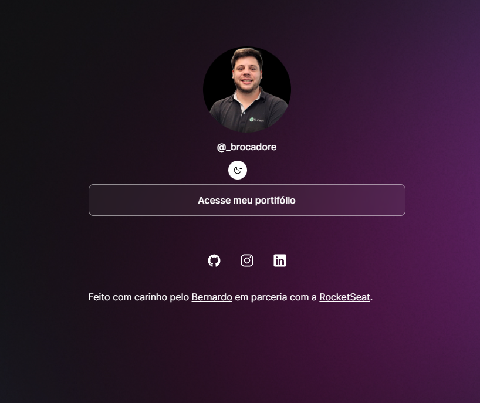

<h1 align="center">
    <a href="#" alt="site do Dev-Links">DevLink</a>
</h1>

<h3 align="center">

🌱 Página web para usar como cartão de visita online.

</h3>

  
  
  
   
   
  

<h4 align="center">
	🚧 Projeto concluído 🚧
</h4>

## 💻 Sobre o projeto

O DevLink - funciona como um agregador de links. Ele pode servir como um cartão de visitas online para uma pessoa ou até mesmo para uma empresa.

Para o meu projeto, utilizei o DevLink como um cartão de visitas que leva as pessoas ao meu portifólio de projetos no GitHub.

O projeto foi desenvolvido durante a **NLW - Next Level Week** oferecida pela [Rocketseat](https://blog.rocketseat.com.br/primeira-next-level-week/).
O NLW é uma experiência online com muito conteúdo prático, desafios onde o conteúdo fica disponível durante uma semana e te desafia a criar um projeto real e útil para compor o seu portifólio.

## ⚙️ Funcionalidades

As funcionalidades desenvolvidas no projeto são:

- [x] **Perfil do Usuário**: Exibe uma imagem de perfil e um nome de usuário.

- [x] **Modo Escuro/Luz**: Permite alternar entre o modo escuro e o modo claro clicando em um botão de switch. O modo escuro altera o esquema de cores da página.

- [x] **Links de Redes Sociais**: Fornece links para as redes sociais do usuário (GitHub, Instagram e LinkedIn), permitindo que os visitantes acessem seus perfis.

- [x] **Links Externos**: Apresenta um link externo para o portfólio do usuário no GitHub.

- [x] **Responsividade**: O layout da página é responsivo e se adapta a diferentes tamanhos de tela, proporcionando uma experiência consistente em dispositivos móveis e desktops.

- [x] **Estilo Visual Atraente**: Utiliza a fonte "Inter" do Google Fonts para uma aparência moderna e legível. O design é limpo e organizado, com ênfase na usabilidade.

- [x] **Animações Suaves**: As animações de transição do botão de switch são suaves e proporcionam uma experiência de usuário agradável.

- [x] **Créditos no Rodapé**: Inclui créditos no rodapé, reconhecendo o desenvolvedor e a parceria com a RocketSeat.

- [x] **Ícones de Rede Social**: Utiliza ícones de redes sociais fornecidos pela biblioteca Ionicons para uma aparência consistente e reconhecível.

- [x] **Acessibilidade**: Os links são configurados para abrir em novas guias, proporcionando uma navegação conveniente e mantendo os usuários na página principal.

## 🛠 Tecnologias

Foi utilizado na construção do projeto as seguintes tecnologias:

<code></code> **HTML**
<code></code> **CSS**
<code></code> **JavaScript**
<code></code> **Git**
<code></code> **GitHub**

## 👀 Visualizando o projeto

Abaixo é possível visualizar a página web que foi desenvolvida:

## 🌐 Hospedagem

Este projeto encontra-se hospedado através do **[GitHub Pages](https://pages.github.com/)**.

#### Pode ser visualizado clicando aqui: **[DevLink-Bernardo Cadore](https://bcadore.github.io/Dev-Link)**

## 🦸 Autor

<a href="https://github.com/bcadore">
    
     
    <b>Bernardo Cadore Ramires</b>
</a>

#### 

## 📝 Licença

Este projeto esta sobe a licença [MIT](./LICENSE).

## ⚠️ Outras considerações

👉 **[Se increva, assista as aulas e monte o seu também.](https://lp.rocketseat.com.br/devlinks/inscricao?utm_source=github&utm_medium=descricao&utm_campaign=capture-devlinks&utm_term=organic&utm_content=descricao-github-mayk-brito)**

 

❤️  <b>MUITO OBRIGADO</b> por visitarem o meu projeto! ❤️

---